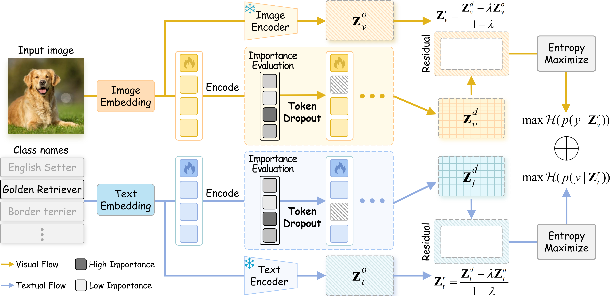

# DroPLe: Dropout Prompt Learning for Vision-Language Models

✨ Welcome to the official repository for "Dropout Prompt Learning: Towards Robust and Adaptive Vision-Language Models". This work is a collaborative effort by Biao Chen, Lin Zuo, Mengmeng Jing, Kunbin He, and Yuchen Wang from the School of Information and Software Engineering, University of Electronic Science and Technology of China (UESTC).

🔗 Read our paper: [ArXiv](https://arxiv.org/abs/2512.07234)

## Overview

🚀 DroPLe introduces a novel paradigm that enhances vision-language model generalization through token-level dropout. Unlike vanilla dropout that randomly removes tokens and disrupts cross-modal alignment, our method proposes **Importance Weighted Token Dropout (IWTD)**, which dynamically adjusts dropout probabilities by jointly considering intra-modal context and inter-modal alignment. Combined with **Residual Entropy Regularization**, DroPLe maintains semantic alignment for general knowledge transfer while encouraging diverse feature representations.



## 🗂 Contents

- [Using DroPLe](#using-drople)
  - [Base-to-Novel Generalization](#base-to-novel-generalization)
  - [Cross-Dataset Evaluation](#cross-dataset-evaluation)
- [Citation](#citation)
- [Acknowledgements](#acknowledgements)

## Using DroPLe

### Base-to-Novel Generalization

In the base-to-novel setting, the model is trained on base classes and evaluated on both base and novel classes. Set `DATASETS_TRAIN` and `DATASETS_TEST` to the same dataset.

```bash
# Edit scripts/launch/launch.sh
DATASETS_TRAIN=("imagenet")
DATASETS_TEST=("ImageNet")

# Run training and evaluation
bash scripts/launch/launch.sh
```

Available datasets: `imagenet`, `caltech101`, `oxford_pets`, `stanford_cars`, `flowers102`, `food101`, `fgvc_aircraft`, `sun397`, `dtd`, `eurosat`, `ucf101`

### Cross-Dataset Evaluation

For cross-dataset evaluation, train on one dataset and evaluate on different target datasets. Set `DATASETS_TRAIN` and `DATASETS_TEST` to different datasets.

```bash
# Edit scripts/launch/launch.sh
DATASETS_TRAIN=("imagenet")
DATASETS_TEST=("Caltech101")  # Or other target datasets
SYNC_DATASETS=false  # Set to false for cross-dataset evaluation

# Run training and evaluation
bash scripts/launch/launch.sh
```

Target datasets: `Caltech101`, `OxfordPets`, `StanfordCars`, `Flowers102`, `Food101`, `FGVCAircraft`, `SUN397`, `DTD`, `EuroSAT`, `UCF101`

## Citation

🤗 If you find our code useful or our work relevant, please consider citing:

```bibtex
@article{chen2025dropout,
  title={Dropout Prompt Learning: Towards Robust and Adaptive Vision-Language Models},
  author={Chen, Biao and Zuo, Lin and Jing, Mengmeng and He, Kunbin and Wang, Yuchen},
  journal={arXiv preprint arXiv:2512.07234},
  year={2025}
}
```

## Acknowledgements

Our work builds upon [Dassl](https://github.com/KaiyangZhou/Dassl.pytorch). Thanks for their excellent work and open-source contributions.